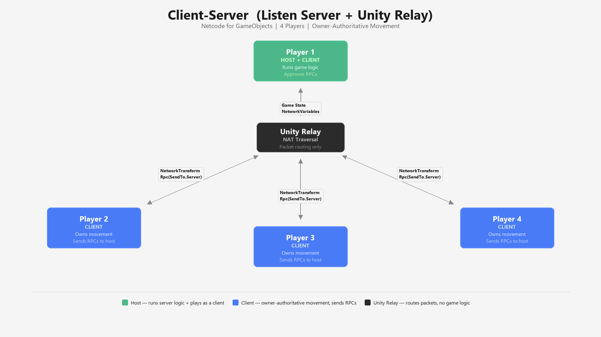

# FriendSlop Template

> **Important:** This repository is provided as a reference sample only. The maintainers **will not** and **cannot** accept pull requests, GitHub review requests, or any other GitHub-hosted issue management requests (bug reports, feature requests, discussions, etc.).

<table>
<tr>
<td align="center"><strong>Singleplayer</strong></td>
<td align="center"><strong>Multiplayer</strong></td>
</tr>
<tr>
<td></td>
<td></td>
</tr>
</table>

## Overview

A first-person multiplayer sample project built with **Unity 6** demonstrating how to combine Netcode for GameObjects, Unity Relay, and Vivox proximity voice chat into a complete networked experience for up to 4 players.

Players can walk, sprint, jump, and ground-slam through a shared environment, pick up and throw physics objects, and communicate via 3D positional voice chat — all with server-authoritative networking.

## Getting Started

1. Clone this repository.
2. Open the project in Unity 6 (`6000.3.5f2`+).
3. Link the project to a Unity Cloud project with Relay and Vivox enabled via **Edit > Project Settings > Services**.
4. Open `Assets/Scenes/Multiplayer.unity` and enter Play mode to host a session, or open `Assets/Scenes/Singleplayer.unity` for solo play.

## Features

- **First-person movement** — walk, sprint, jump (with coyote time and jump buffering), air control, and ground slam
- **Networked item interaction** — pick up, hold, rotate, and throw physics objects with server-authoritative positioning
- **Lobby and Relay flow** — host or join sessions through Unity Relay with a clean lobby UI; supports up to 4 players
- **Proximity voice chat** — 3D positional audio via Vivox with a visible speaking indicator
- **Player differentiation** — unique head colours assigned per player (Blue, Pink, Green, Yellow)
- **Singleplayer mode** — a standalone scene for exploring mechanics without networking
- **Connection approval** — server-side player cap and designated spawn points

### Key Scripts

| Script | Purpose |
|---|---|
| `GameManager.cs` | Singleton managing game state (Lobby/Playing) via NetworkVariable |
| `LobbyController.cs` | Coordinates Relay, NetworkManager, and lobby UI |
| `RelayManager.cs` | Unity Relay allocation, anonymous auth, Vivox login |
| `PlayerMovement.cs` | FPS CharacterController — walk, sprint, jump, slam, camera look |
| `PlayerInteraction.cs` | Raycast-based item pickup, drop, and rotation |
| `PickupItem.cs` | Server-authoritative networked physics object |
| `PlayerSpawnManager.cs` | Connection approval and spawn point assignment |
| `ProximityVoice.cs` | Vivox 3D positional voice channel management |

## Key Packages

| Package | Version |
|---|---|
| Netcode for GameObjects | 2.12.0 |
| Unity Transport | (via NGO) |
| Unity Relay / Multiplayer Services | 2.2.3 |
| Vivox | 16.11.0 |
| Input System | 1.17.0 |
| Cinemachine | 3.1.3 |
| Universal Render Pipeline | 17.3.0 |

### Network Architecture

## License

Licensed under the [Unity Companion License](https://unity3d.com/legal/licenses/unity_companion_license) for Unity-dependent projects. See [LICENSE.md](LICENSE.md) for details.
